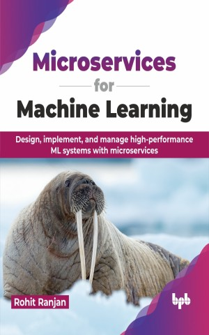

# Microservices for Machine Learning

Empowering AI innovations: The fusion of microservices and ML

This is the repository for [Microservices for Machine Learning
](https://bpbonline.com/products/microservices-for-machine-learning?variant=43559038582984),published by BPB Publications.

## About the Book
Explore the link between microservices and ML in Microservices for Machine Learning. Through this book, you will learn to build scalable systems by understanding modular software construction principles. You will also discover ML algorithms and tools like TensorFlow and PyTorch for developing advanced models.

It equips you with the technical know-how to design, implement, and manage high-performance ML applications using microservices architecture. It establishes a foundation in microservices principles and core ML concepts before diving into practical aspects. You will learn how to design ML-specific microservices, implement them using frameworks like Flask, and containerize them with Docker for scalability. Data management strategies for ML are explored, including techniques for real-time data ingestion and data versioning. This book also addresses crucial aspects of securing ML microservices and using CI/CD practices to streamline development and deployment. Finally, you will discover real-world use cases showcasing how ML microservices are revolutionizing various industries, alongside a glimpse into the exciting future trends shaping this evolving field.

Additionally, you will learn how to implement ML microservices with practical examples in Java and Python. This book merges software engineering and AI, guiding readers through modern development challenges. It is a guide for innovators, boosting efficiency and leading the way to a future of impactful technology solutions.

## What You Will Learn
• Master the principles of microservices architecture for scalable software design.

• Deploy ML microservices using cloud platforms like AWS and Azure for scalability. 

• Ensure ML microservices security with best practices in data encryption and access control.

• Utilize Docker and Kubernetes for efficient microservice containerization and orchestration.

• Implement CI/CD pipelines for automated, reliable ML model deployments. 
